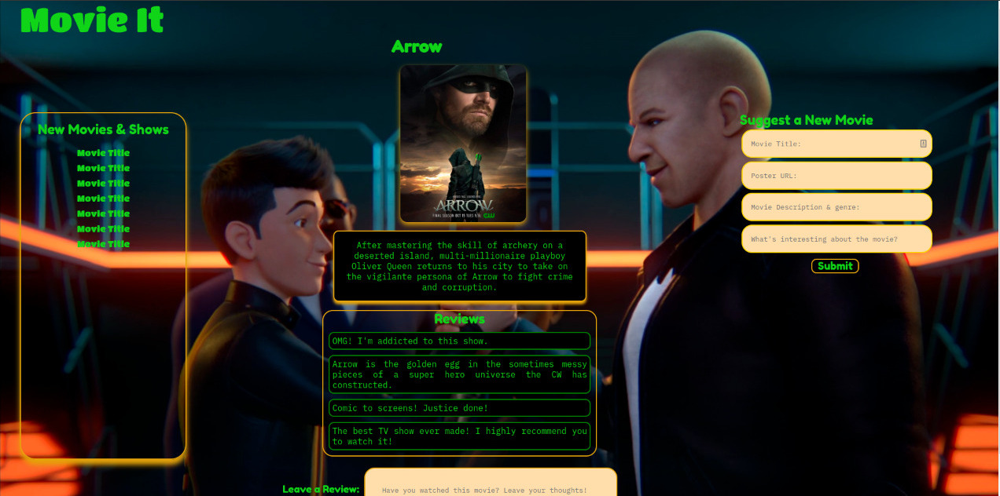
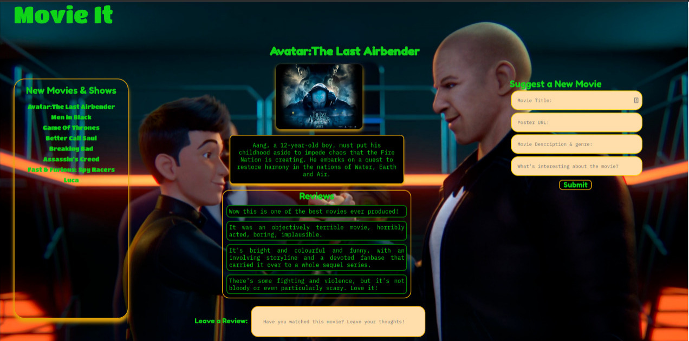

# movie-it

**By Brayarn Oduor**

# Table of Content

- [Description](##Description)
- [Technology Used](##Technology-Used)
- [Licenses](##Licenses)
- [Known Bugs](##Known-Bugs)
- [References](##References)
- [Author Info & Contacts](##Author-Info)

## Description

MovieIt is an opensource that collects user reviews and displays them on the page to help end users know if a movie or television show will be worth their time. It also collects user's latest movie suggestions so that the movie vendor can add it to his/her repository. MovieIt can be thought of as an interface that the movie vendors(or movie shops) and users can get to know what others think about a movie, and contribute to the list of available movies.
## Screenshot

<!--  -->
<!--  -->

## Technology Used

- HTML - Used to build the structure of the page.
- CSS - For styling of the pages.
- Javascript - Manipulating the DOM

## Known Bugs

The project has no known bug at the moment.

## References

- Google Fonts APIs

## Licenses

MIT License

Copyright (c) 2022 Brayarn Oduor

Permission is hereby granted, free of charge, to any person obtaining a copy
of this software and associated documentation files (the "Software"), to deal
in the Software without restriction, including without limitation the rights
to use, copy, modify, merge, publish, distribute, sublicense, and/or sell
copies of the Software, and to permit persons to whom the Software is
furnished to do so, subject to the following conditions:

The above copyright notice and this permission notice shall be included in all
copies or substantial portions of the Software.

THE SOFTWARE IS PROVIDED "AS IS", WITHOUT WARRANTY OF ANY KIND, EXPRESS OR
IMPLIED, INCLUDING BUT NOT LIMITED TO THE WARRANTIES OF MERCHANTABILITY,
FITNESS FOR A PARTICULAR PURPOSE AND NONINFRINGEMENT. IN NO EVENT SHALL THE
AUTHORS OR COPYRIGHT HOLDERS BE LIABLE FOR ANY CLAIM, DAMAGES OR OTHER
LIABILITY, WHETHER IN AN ACTION OF CONTRACT, TORT OR OTHERWISE, ARISING FROM,
OUT OF OR IN CONNECTION WITH THE SOFTWARE OR THE USE OR OTHER DEALINGS IN THE
SOFTWARE.

## Author Info

- Email: brayarn.oduor@student.moringaschool.com
- LinkedIn: [Brayarn Oduor](https://www.linkedin.com/in/brayarn-ogeda-aa522815b/)

## link to site

- [movie-it](https://ogedabrayarn.github.io/movie-it/)
